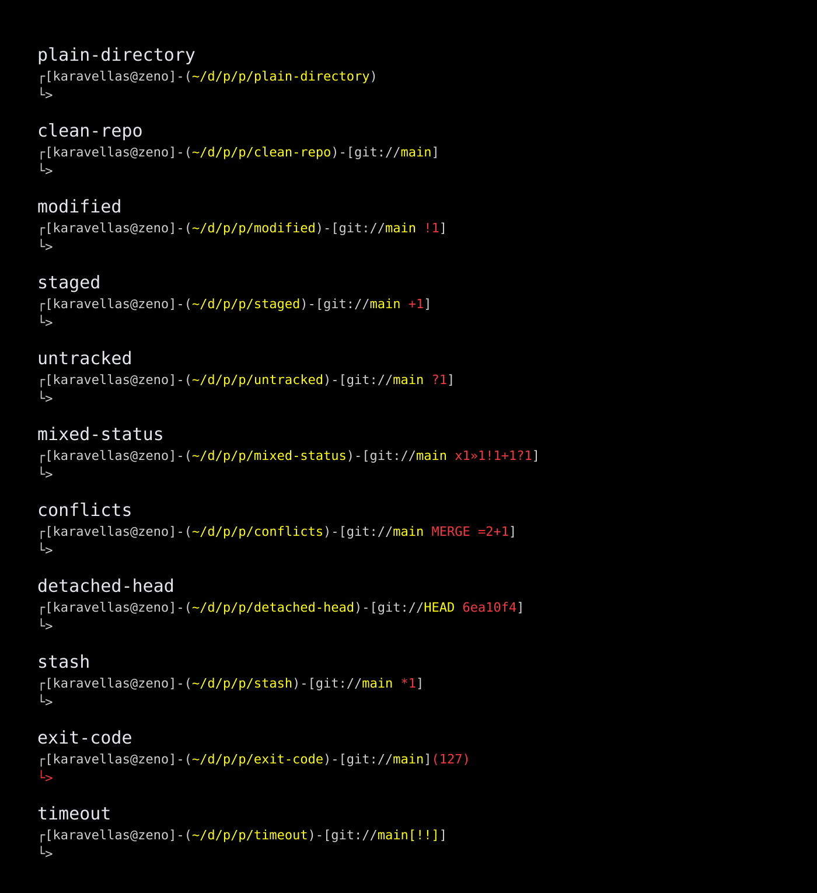

# Bashline

An opinionated, Git-aware prompt for Bash. It keeps your current location, repository state, and command failures visible without getting in your way.

Bashline is a single C source file built with libgit2 linked statically.

It was created for large repositories and slow or remote filesystems, where other prompts can become sluggish.
Bashline limits Git status collection with a timeout so your shell stays responsive but still showing the branch.

## Install

Download the `bashline` binary from the [latest release](../../releases/latest), then install it to `~/.local/bin`:

```bash
mkdir -p "$HOME/.local/bin"
install -m 755 "path/to/bashline" "$HOME/.local/bin/bashline"
```

## Use It

Add the following line to `~/.bashrc`:

```bash
PROMPT_COMMAND='PS1="$("$HOME/.local/bin/bashline" "$?")"'
```

Start a new shell or reload your configuration:

```bash
source ~/.bashrc
```

## Git Timeout

Bashline allows up to 500 milliseconds to collect Git details. To use a different timeout, add `BASHLINE_TIMEOUT_MS` to `~/.bashrc`:

```bash
export BASHLINE_TIMEOUT_MS=100
```

Set it to `0` to wait without a timeout.

## Showcase



The prompt shows:

- Your username and hostname
- A shortened path to the current directory
- The current Git branch
- Git changes, stashes, and upstream status
- The exit code when the previous command fails
- Active Git operations such as merges, rebases, and cherry-picks

Git state is summarized with these symbols:

| Symbol | Meaning |
|---|---|
| `=` | Conflicted files |
| `*` | Stashes |
| `x` | Deleted files |
| `»` | Renamed files |
| `!` | Modified files |
| `+` | Staged files |
| `?` | Untracked files |
| `⇡` | Commits ahead |
| `⇣` | Commits behind |
| `⇕` | Diverged from upstream |

## Build From Source

Clone the repository and run:

```bash
make
make setup
```

`make` builds `./bashline`. `make setup` installs it to `~/.local/bin`, adds the Bashline configuration to `~/.bashrc`, and leaves an existing configuration unchanged.
